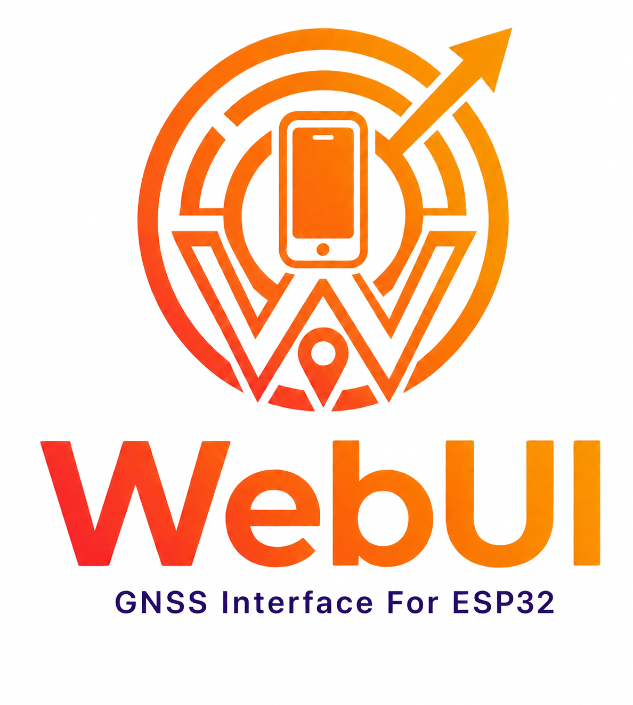
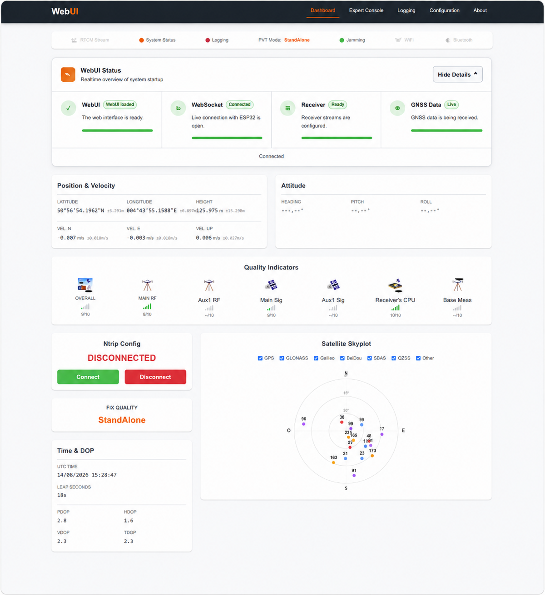
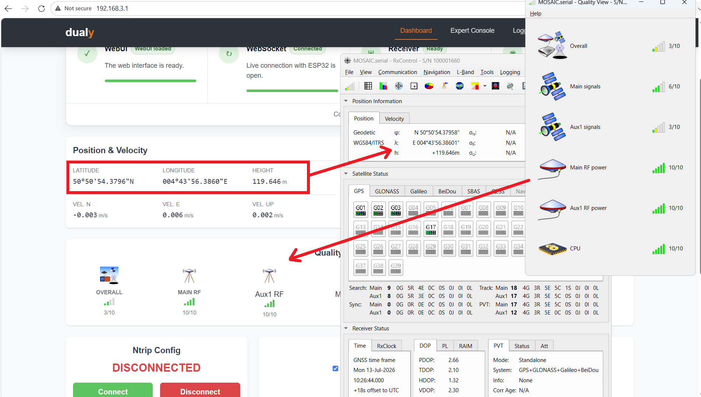
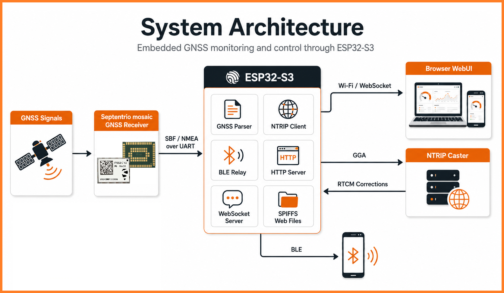
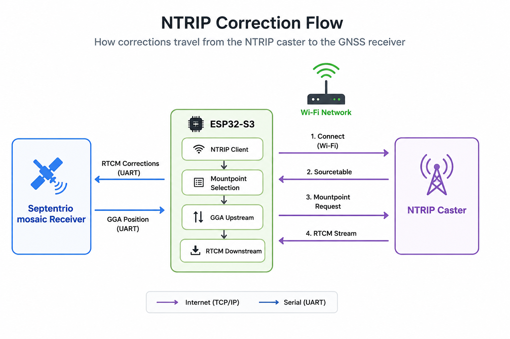

<div align="center">



# WebUI

### Open-Source GNSS Monitoring & Control Interface for ESP32

A responsive, browser-based interface for monitoring, configuring and controlling  
**Septentrio mosaic GNSS receivers** through an **ESP32-S3**.

<br>


<br><br>

**Professional GNSS visibility directly from a browser.**

<br>

<a href="docs/getting-started/README.md">
  
</a>
<a href="docs/README.md">
  
</a>
<a href="docs/testing/README.md">
  
</a>
<a href="docs/troubleshooting/README.md">
  
</a>

</div>

---

## Overview

**WebUI** turns an ESP32-S3 into an embedded interface for a **Septentrio mosaic GNSS receiver**.

The ESP32 communicates directly with the receiver, processes the required **SBF** and **NMEA** data, and exposes the information through a responsive web interface using real-time **WebSocket communication**.

The interface can be accessed from:

- a laptop
- a smartphone
- a tablet
- any modern browser connected to the ESP32 network

WebUI was originally developed and validated using **Dualy** as its reference implementation. The software architecture, however, is designed to remain reusable across compatible **ESP32 + Septentrio mosaic** integrations.

> **Septentrio RxControl remains the reference application for complete receiver configuration, firmware operations and advanced diagnostics.**
>
> WebUI focuses on embedded monitoring, field operation and integration.

---

## Key Features

<table>
<tr>
<td width="50%" valign="top">

### GNSS Monitoring

- Position and velocity
- PVT solution mode
- DGNSS / RTK status
- Position uncertainty
- Satellite visibility
- Dynamic skyplot
- RF and signal quality
- Receiver health
- Jamming indicators

</td>

<td width="50%" valign="top">

### Connectivity & Corrections

- Wi-Fi Access Point
- Wi-Fi Station mode
- Combined AP + STA operation
- Embedded NTRIP client
- Dynamic mountpoint retrieval
- RTCM correction handling
- Bluetooth Low Energy relay
- Live WebSocket telemetry

</td>
</tr>

<tr>
<td width="50%" valign="top">

### Receiver Control

- Expert Console
- Receiver commands
- SBF / NMEA stream configuration
- Remote logging control
- Persistent configuration
- Receiver status feedback

</td>

<td width="50%" valign="top">

### Embedded Web Interface

- No dedicated desktop application required
- Responsive desktop and mobile layout
- Browser-based configuration
- Real-time status indicators
- SPIFFS-hosted frontend
- Fast WebUI-first startup architecture

</td>
</tr>
</table>

---

## Live Interface

<div align="center">



<br>

*Live GNSS monitoring, receiver status, satellites, logging and connectivity from a single interface.*

</div>

---

## Validated Against RxControl

WebUI positioning and receiver information were cross-checked against **Septentrio RxControl** using live receiver data.

<div align="center">



</div>

Validation included:

- Latitude and longitude
- Ellipsoidal height
- Velocity
- PVT mode
- Quality indicators
- RF information
- Receiver status

The purpose of this comparison is to confirm that the embedded WebUI represents the receiver information consistently with the Septentrio reference interface.

See the [Testing & Validation Guide](docs/testing/README.md) for more information.

---

## System Architecture

WebUI uses the ESP32-S3 as the central bridge between the **Septentrio mosaic GNSS receiver**, the **browser interface**, the **NTRIP correction service**, and optional **Bluetooth clients**.

<div align="center">



<br>

<sub>
GNSS data flows from the mosaic receiver to the ESP32-S3, where it is parsed and distributed to the browser through WebSocket communication.  
The ESP32 can also exchange GGA and RTCM corrections with an NTRIP caster and provide BLE connectivity to mobile devices.
</sub>

</div>

> For a detailed description of the firmware architecture, task separation, data flow and hardware abstraction, see the [Architecture Guide](docs/architecture/README.md).

## NTRIP Correction Flow

The NTRIP workflow allows WebUI to retrieve correction data from an external caster and forward it to the GNSS receiver through the ESP32-S3.

<div align="center">



<br>

<sub>
The ESP32-S3 connects to a Wi-Fi network, requests the sourcetable from the NTRIP caster, selects a mountpoint, sends GGA messages upstream when needed, and receives RTCM correction data back.  
These RTCM corrections are then forwarded to the Septentrio mosaic receiver to improve positioning performance.
</sub>

</div>

> For implementation details about NTRIP configuration, mountpoint fetching, connection logic, and RTCM forwarding, see the [Connectivity Guide](docs/connectivity/README.md).

## Quick Start

Choose your development environment and follow the corresponding commands.

<table>
<tr>
<th width="50%">🐧 Linux / macOS</th>
<th width="50%">🪟 Windows PowerShell</th>
</tr>

<tr>
<td valign="top">

### 1. Clone the repository

<pre><code>git clone https://github.com/septentrio-gnss/WebUi.git
cd WebUi</code></pre>

</td>
<td valign="top">

### 1. Clone the repository

<pre><code>git clone https://github.com/septentrio-gnss/WebUi.git
cd WebUi</code></pre>

</td>
</tr>

<tr>
<td valign="top">

### 2. Build the firmware

<pre><code>pio run</code></pre>

</td>
<td valign="top">

### 2. Build the firmware

<pre><code>& "$env:USERPROFILE\.platformio\penv\Scripts\platformio.exe" run</code></pre>

</td>
</tr>

<tr>
<td valign="top">

### 3. Prepare the WebUI assets

<pre><code>python3 compress_webui.py</code></pre>

</td>
<td valign="top">

### 3. Prepare the WebUI assets

<pre><code>& "$env:USERPROFILE\.platformio\penv\Scripts\python.exe" .\compress_webui.py</code></pre>

</td>
</tr>

<tr>
<td valign="top">

### 4. Upload the firmware

<pre><code>pio run -t upload</code></pre>

</td>
<td valign="top">

### 4. Upload the firmware

<pre><code>& "$env:USERPROFILE\.platformio\penv\Scripts\platformio.exe" run -t upload</code></pre>

</td>
</tr>

<tr>
<td valign="top">

### 5. Upload the WebUI filesystem

<pre><code>pio run -t uploadfs</code></pre>

</td>
<td valign="top">

### 5. Upload the WebUI filesystem

<pre><code>& "$env:USERPROFILE\.platformio\penv\Scripts\platformio.exe" run -t uploadfs</code></pre>

</td>
</tr>
</table>

> [!TIP]
> If `pio` is already available in your Windows `PATH`, the shorter commands `pio run`, `pio run -t upload`, and `pio run -t uploadfs` work as well.

### 6. Connect to WebUI

After a successful boot, the ESP32 creates its local configuration network:

| Setting | Default |
|---|---|
| **Wi-Fi SSID** | `WEBUI_CONFIG` |
| **IP Address** | `192.168.3.1` |
| **mDNS** | `http://webui.local` |

Connect your laptop, smartphone, or tablet to `WEBUI_CONFIG`, then open:

http://192.168.3.1

## Documentation

| Guide | Contents |
|---|---|
| **[Getting Started](docs/getting-started/README.md)** | Installation, PlatformIO, firmware upload, SPIFFS and first boot |
| **[User Guide](docs/user-guide/README.md)** | Dashboard, Expert Console, logging and configuration |
| **[Architecture](docs/architecture/README.md)** | Firmware organization, task separation and data flow |
| **[Connectivity](docs/connectivity/README.md)** | Wi-Fi, NTRIP, RTCM and Bluetooth |
| **[GNSS Integration](docs/gnss/README.md)** | SBF, NMEA, mosaic communication and supported blocks |
| **[Testing & Validation](docs/testing/README.md)** | Functional tests and RxControl comparison |
| **[Troubleshooting](docs/troubleshooting/README.md)** | WebUI, SPIFFS, UART, GNSS, NTRIP and BLE diagnostics |

The complete documentation index is available in [`docs/README.md`](docs/README.md).

---

## Repository Structure
```text

WebUI/
│
├── src/
│   ├── ble/
│   ├── config/
│   ├── gnss/
│   ├── led/
│   ├── logging/
│   ├── ntrip/
│   ├── utils/
│   ├── web/
│   └── websocket/
│
├── include/              Shared headers and configuration
│
├── data_src/             Editable WebUI source files
├── data/                 Compressed files uploaded to SPIFFS
├── test/                 Development and validation tools
│
├── docs/
│   ├── getting-started/
│   ├── user-guide/
│   ├── architecture/
│   ├── connectivity/
│   ├── gnss/
│   ├── testing/
│   ├── troubleshooting/
│   └── images/
│
├── compress_webui.py
├── platformio.ini
└── README.md

---

## Technology Stack

| Layer | Technology |
|---|---|
| MCU | ESP32-S3 |
| GNSS Receiver | Septentrio mosaic |
| Firmware | C++ / Arduino |
| Build System | PlatformIO |
| Runtime | FreeRTOS |
| Receiver Data | SBF + NMEA |
| Corrections | NTRIP + RTCM |
| Browser Telemetry | WebSocket + JSON |
| HTTP Server | ESPAsyncWebServer |
| Wireless | Wi-Fi + BLE |
| Web Storage | SPIFFS |
```
---

## Design Principles

### Embedded

The interface runs directly on the ESP32.  
No external web server is required.

### Reusable

Dualy is the reference implementation, not a limitation of the WebUI architecture.

### Observable

The interface and serial diagnostics are designed to make the state of GNSS, Wi-Fi, NTRIP, Bluetooth and receiver communication immediately visible.

---

## Project Status

| Capability | Status |
|---|:---:|
| ESP32-hosted WebUI | ✅ Validated |
| Wi-Fi Access Point | ✅ Validated |
| Wi-Fi AP + STA | ✅ Validated |
| WebSocket telemetry | ✅ Validated |
| mosaic UART communication | ✅ Validated |
| SBF / NMEA parsing | ✅ Validated |
| Position & velocity display | ✅ Validated |
| Quality indicators | ✅ Validated |
| Satellite monitoring | ✅ Implemented |
| Expert Console | ✅ Implemented |
| Receiver logging control | ✅ Implemented |
| NTRIP configuration | ✅ Validated |
| Dynamic NTRIP mountpoint retrieval | ✅ Validated |
| RTCM correction chain | 🔄 Final validation |
| BLE integration | ✅ Implemented |
| RxControl comparison | ✅ Validated |

Development and validation details are maintained in the dedicated documentation and repository issues.

---

## Contributing

Contributions should prioritize:

- reliability
- GNSS data accuracy
- readable and maintainable code
- efficient ESP32 resource usage
- hardware portability
- clear documentation
- reproducible testing

See [`CONTRIBUTING.md`](CONTRIBUTING.md) before submitting changes.

---

## Support

Before opening an issue, check:

1. [Getting Started](docs/getting-started/README.md)
2. [Troubleshooting](docs/troubleshooting/README.md)
3. [Known Issues](KNOWN_ISSUES.md)

For complete receiver configuration, firmware operations and official technical support, refer to **Septentrio RxControl** and the official Septentrio documentation.

---

## License

The final open-source license must be approved before public publication.

See [`LICENSE`](LICENSE) once available.

---

## Acknowledgments

WebUI was developed using **Dualy** as its primary reference implementation.

Special thanks to:

- **Ariel Kriss Sany** — WebUI collaboration, technical discussions and development support
- **Adham Ali** — embedded integration, ESP32 firmware, GNSS parsing, WebUI development, validation, hardware testing and technical documentation
- **Septentrio engineers and project reviewers** — GNSS expertise, receiver validation, hardware support and technical feedback
- **Open-source maintainers** — for the networking, WebSocket, JSON and embedded-development libraries used by the project

---

<div align="center">


### WebUI

**Embedded GNSS. Real-time visibility. Anywhere.**

ESP32-S3 × Septentrio mosaic × WebSocket

</div>
