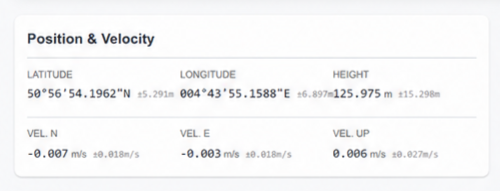
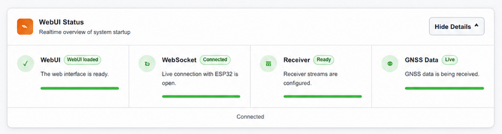
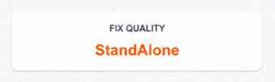

<div align="center">


# WebUI 

### Open-Source GNSS Monitoring and Control Interface for ESP32

A responsive, browser-based interface for monitoring, configuring, and controlling Septentrio mosaic GNSS receivers through an ESP32-S3.

[](#hardware-architecture)
[](#software-prerequisites)
[](#project-overview)
[](#data-protocols)
[](#user-guide)
[](#project-status)

**Access professional GNSS receiver information directly from a browser, without requiring a dedicated desktop application for routine field operations.**

</div>

---

## Table of Contents

- [Project Overview](#project-overview)
- [Project Goals](#project-goals)
- [Dualy as Reference Implementation](#dualy-as-reference-implementation)
- [Key Features](#key-features)
- [Screenshots](#screenshots)
- [Hardware Architecture](#hardware-architecture)
- [Software Prerequisites](#software-prerequisites)
- [Installation Guide](#installation-guide)
- [User Guide](#user-guide)
  - [Dashboard](#1-dashboard)
  - [Expert Console](#2-expert-console)
  - [Logging Control](#3-logging-control)
  - [Configuration](#4-configuration)
- [Trade-Off Analysis](#trade-off-analysis)
- [Technical Implementation](#technical-implementation)
- [Data Protocols](#data-protocols)
- [Repository Structure](#repository-structure)
- [Troubleshooting](#troubleshooting)
- [Testing and Validation](#testing-and-validation)
- [Project Status](#project-status)
- [Roadmap](#roadmap)
- [Contributing](#contributing)
- [Reference Documentation](#reference-documentation)
- [Acknowledgments](#acknowledgments)
- [Disclaimer](#disclaimer)
- [License](#license)

---

## Project Overview

**WebUI** is a universal, web-based interface designed to monitor, configure, and control Septentrio mosaic GNSS receivers.

The system runs on an **ESP32-S3**, which acts as a bridge between the GNSS receiver and the user. The ESP32 receives the GNSS data stream, decodes the required information, and exposes it through a responsive HTML5 dashboard accessible from any modern browser.

The interface can be opened from:

- A laptop
- A smartphone
- A tablet
- Any device connected to the ESP32 network

The WebUI provides a lightweight alternative for field monitoring and embedded integration, while official tools such as **Septentrio RxControl** remain the reference for complete receiver configuration, advanced diagnostics, and firmware management.

The project processes real-time receiver data such as:

- Position and velocity
- Attitude
- PVT mode
- Satellite visibility
- RF quality
- Signal quality
- Receiver CPU state
- Interference and jamming status
- NTRIP correction state
- Logging state

The original implementation was developed and validated using the **Dualy** embedded platform.

---

## Project Goals

The main objective of WebUI is to make professional GNSS receiver data more accessible to embedded and open-source projects.

The project aims to:

- Read GNSS receiver data through an ESP32
- Display GNSS information in real time from a web browser
- Provide an interface inspired by professional receiver-monitoring workflows
- Remove the requirement for a dedicated desktop application during basic field operations
- Allow local operation without Internet access
- Support custom robotics, positioning, instrumentation, and navigation projects
- Provide a reusable architecture for future ESP32 and GNSS integrations
- Enable users to configure connectivity, logging, and positioning functions remotely
- Offer clear feedback when the receiver or data stream is not ready

WebUI is not intended to reproduce every function of RxControl. Its purpose is to provide an embedded, lightweight, and extensible GNSS interface suitable for open-source systems.

---

## Dualy as Reference Implementation

**Dualy** was used as the primary reference platform and demonstration system for WebUI.

The Dualy implementation combines:

- ESP32-S3 processing
- Septentrio mosaic GNSS receiver
- Main and auxiliary antenna inputs
- UART receiver communication
- Wi-Fi Access Point and Station modes
- WebSocket telemetry
- Embedded NTRIP client
- Bluetooth Low Energy relay
- Receiver logging control
- Browser-based configuration
- System-status monitoring

Dualy demonstrates how the WebUI can be integrated into a complete embedded GNSS product.

However, the WebUI architecture is designed to remain reusable. The firmware can be adapted to other ESP32 boards and compatible GNSS receivers by modifying:

- UART configuration
- Receiver command handling
- Binary message parsing
- Hardware pin assignments
- Supported telemetry blocks

---

## Key Features

### Real-Time Dashboard

- Latitude, longitude, and ellipsoidal height
- North, East, and Up velocity
- Heading, pitch, and roll where available
- PVT mode and fix status
- Standard-deviation and covariance information
- Receiver quality indicators
- Satellite skyplot
- RF and interference monitoring
- Receiver CPU state
- Logging and connectivity indicators

### Dynamic Satellite Skyplot

- Satellite positioning based on azimuth and elevation
- Support for multiple constellations
- GPS
- GLONASS
- Galileo
- BeiDou
- SBAS
- QZSS
- Constellation visibility filters
- Signal and usage information where available

### Quality Indicators

Visual receiver-quality scores derived from the SBF `QualityInd` block:

- Overall quality
- Main RF quality
- Auxiliary RF quality
- Main signal quality
- Auxiliary signal quality
- Receiver CPU quality
- Base measurement quality

### Embedded NTRIP Client

- Wi-Fi connection to an external network
- NTRIP caster configuration
- Mountpoint selection
- Source-table retrieval
- RTCM correction reception
- Correction-data injection into the GNSS receiver
- Optional periodic GGA transmission to the caster
- Credential storage in ESP32 non-volatile memory

### Bluetooth Low Energy Relay

- Nordic UART Service-compatible BLE transport
- NMEA transmission to mobile applications
- RTCM reception from supported mobile applications
- Wireless GNSS bridge for field use
- Runtime activation and deactivation

### Receiver Logging

- Remote start and stop commands
- SBF logging
- NMEA logging
- Selectable block or sentence filters
- Logging status feedback
- Storage directly on the receiver SD card where supported

### Expert Console

- Direct receiver-command input
- Receiver-response visualization
- Filtered diagnostic output
- Quick-access command buttons
- Receiver reboot command
- Stream configuration commands
- Persistent configuration commands

### Responsive Interface

- Desktop, tablet, and mobile layouts
- Scrollable navigation on smaller screens
- Stacked data panels on narrow displays
- Browser-based operation
- No application installation required
- Single-page application behavior

### System Diagnostics

- WebUI loaded state
- WebSocket connection state
- Receiver initialization state
- GNSS stream availability
- Wi-Fi state
- Bluetooth state
- NTRIP state
- Logging state
- Jamming state
- System-health indicators

---

## Screenshots

The following screenshots show the WebUI during live GNSS operation and validation against Septentrio RxControl.

### WebUI Logo


---

### WebUI and RxControl Comparison

This screenshot shows live position and quality values displayed simultaneously in WebUI and RxControl.


The comparison was used to verify:

- Latitude
- Longitude
- Height
- Velocity
- PVT state
- Quality indicator values
- Main and auxiliary RF information

---

### Live Dashboard


The main dashboard provides a complete overview of:

- Position and velocity
- PVT mode
- System state
- Receiver quality
- NTRIP status
- Satellite information

---

### Quality Indicators


The displayed indicators are decoded from the receiver `QualityInd` block and converted to a simplified visual scale.

---

### Position and Velocity



The receiver position is presented in degrees, minutes, and seconds, together with ellipsoidal height and North-East-Up velocity.

---

### System Status Bar


The top status bar provides immediate feedback for:

- RTCM corrections
- System status
- Logging
- PVT mode
- Jamming
- Wi-Fi
- Bluetooth

---

### Receiver Initialization



The initialization panel indicates whether each critical service is available:

- WebUI
- WebSocket
- Receiver communication
- GNSS data stream

---

### No-Data State


When receiver data are unavailable, the interface displays placeholders rather than misleading zero values.

---

### Standalone Positioning Mode



The PVT mode is highlighted to make the current solution type immediately visible.

---

## Hardware Architecture

### Required Components

| Component | Purpose |
|---|---|
| ESP32-S3 development board or custom board | Embedded processing, Wi-Fi, BLE, and WebUI hosting |
| Septentrio mosaic GNSS receiver | High-precision positioning and receiver telemetry |
| GNSS antenna | Satellite signal reception |
| Optional auxiliary antenna | Heading and dual-antenna measurements |
| UART interface | ESP32-to-receiver communication |
| USB connection | Programming, diagnostics, and power |
| Optional receiver SD card | SBF and NMEA logging |

### Reference UART Connection

The original development setup used the ESP32-S3 `Serial2` interface.

| ESP32-S3 | mosaic receiver | Description |
|---|---|---|
| GND | GND | Common electrical reference |
| RX GPIO | COMx TX | ESP32 receives SBF, NMEA, and receiver responses |
| TX GPIO | COMx RX | ESP32 sends commands and RTCM corrections |

Example pin assignment from the original prototype:

| Signal | ESP32 GPIO |
|---|---:|
| Receiver RX | GPIO 21 |
| Receiver TX | GPIO 12 |

> Pin assignments may differ on the final Dualy hardware or another target platform. Always verify the schematic and firmware configuration before connecting the receiver.

### Voltage Compatibility

Both devices must use compatible UART logic levels.

The reference design operates with:

```text
UART logic level: 3.3 V
```

Do not connect 5 V UART signals directly to the ESP32.

### System Data Flow

```text
┌────────────────────────┐
│  Septentrio mosaic     │
│  GNSS Receiver         │
│                        │
│  SBF                    │
│  NMEA                   │
│  Receiver Responses     │
└────────────┬───────────┘
             │
             │ UART
             ▼
┌────────────────────────┐
│       ESP32-S3         │
│                        │
│  SBF Parser             │
│  NMEA Parser            │
│  NTRIP Client           │
│  BLE Relay              │
│  HTTP Server            │
│  WebSocket Server       │
│  SPIFFS Web Hosting     │
└────────────┬───────────┘
             │
             │ Wi-Fi
             │ HTTP + WebSocket
             ▼
┌────────────────────────┐
│      Web Browser       │
│                        │
│  Dashboard              │
│  Expert Console         │
│  Logging                │
│  Configuration          │
└────────────────────────┘
```

---

## Software Prerequisites

### Recommended Development Environment

- [Visual Studio Code](https://code.visualstudio.com/)
- [PlatformIO](https://platformio.org/)
- Git
- USB serial driver required by the target board
- Modern web browser

Arduino IDE 2.x may also be used, but PlatformIO is recommended because the project contains multiple source modules, dependencies, build environments, and filesystem assets.

### ESP32 Platform

Recommended:

```text
Espressif32 Platform
Arduino Framework
ESP32-S3 target
```

### Main Dependencies

| Library | Purpose |
|---|---|
| ESPAsyncWebServer | Asynchronous HTTP server |
| AsyncTCP | TCP transport for the asynchronous server |
| WebSockets by Markus Sattler | Real-time browser telemetry |
| ArduinoJson | JSON serialization and parsing |
| ESP32 BLE Arduino | Bluetooth Low Energy functionality |
| Preferences | Persistent ESP32 configuration |
| mbedTLS | Base64 authentication support for NTRIP |
| SPIFFS | Embedded web-asset storage |

Example `platformio.ini` dependency section:

```ini
lib_deps =
    links2004/WebSockets
    bblanchon/ArduinoJson
    ESP32Async/ESPAsyncWebServer
```

The exact dependency versions should be pinned in the production repository to ensure reproducible builds.

---

## Installation Guide

### 1. Clone the Repository

```bash
git clone https://github.com/YOUR-ORGANIZATION/YOUR-REPOSITORY.git
cd YOUR-REPOSITORY
```

Replace the placeholder URL with the final public repository address.

---

### 2. Open the Project

Open the repository folder in Visual Studio Code.

PlatformIO should automatically detect:

```text
platformio.ini
```

and install the required ESP32 platform and project libraries.

---

### 3. Review the Hardware Configuration

Before flashing, verify:

- Target ESP32 board
- UART RX and TX pins
- GNSS receiver baud rate
- Flash size
- PSRAM configuration
- Filesystem type
- Partition table
- Upload port
- Serial monitor port

Example:

```ini
[env:esp32-s3]
platform = espressif32
board = esp32-s3-devkitm-1
framework = arduino

monitor_speed = 115200
board_build.filesystem = spiffs
board_build.partitions = partitions.csv
```

---

### 4. Build the Firmware

```bash
pio run
```

A successful build confirms that:

- The ESP32 platform is installed
- Required libraries are available
- Source modules compile correctly
- The selected board configuration is valid

---

### 5. Upload the Web Filesystem

The browser interface is stored in the ESP32 flash memory.

Typical files include:

```text
data/
├── index.html
├── style.css
├── chart.js
├── app.js
└── assets/
```

If the project uses web-file compression, run:

```bash
python tools/compress_web.py
```

Then upload the filesystem:

```bash
pio run --target uploadfs
```

In the PlatformIO interface, the equivalent task is:

```text
Platform → Upload Filesystem Image
```

The filesystem must be uploaded whenever the HTML, CSS, JavaScript, icons, or image assets are changed.

---

### 6. Upload the Firmware

```bash
pio run --target upload
```

Then open the serial monitor:

```bash
pio device monitor
```

Default monitor speed:

```text
115200 baud
```

---

### 7. First-Time Configuration

On first boot, the ESP32 starts a Wi-Fi Access Point.

Default example:

```text
SSID: DUALY_CONFIG
IP address: 192.168.3.1
```

Connect a laptop, smartphone, or tablet to this network.

Open:

```text
http://192.168.3.1
```

If mDNS is enabled, the following address may also be available:

```text
http://dualy.local
```

Open the **Configuration** page to enter:

- Local Wi-Fi credentials
- NTRIP caster information
- Bluetooth settings
- Positioning-mode settings

Some network changes may require a reboot.

---

## User Guide

## 1. Dashboard

The Dashboard is the main operational view of WebUI.

It aggregates real-time information parsed from the receiver SBF stream.

### A. Status Bar

The status bar provides immediate system feedback.

#### RTCM Stream

Indicates whether RTCM correction data are being received and injected into the receiver.

Possible states:

- Inactive
- Connecting
- Active
- Error

#### System Status

Represents the receiver's global health.

A warning or error state may be derived from the `ReceiverStatus` SBF block.

#### Logging

Indicates whether receiver logging is currently active.

The indicator becomes active when an SBF or NMEA logging session is running.

#### PVT Mode

Displays the current positioning mode.

Examples:

- `NO FIX`
- `StandAlone`
- `DGNSS`
- `RTK Float`
- `RTK Fixed`

The color can change according to the solution quality.

#### Jamming

Displays RF interference or jamming information based on the receiver `RFStatus` block.

#### Connectivity

Wi-Fi and Bluetooth icons indicate whether the corresponding ESP32 services are active.

---

### B. Position and Velocity Panel

This panel displays navigation information decoded from SBF positioning blocks.

Typical data sources include:

- `PVTGeodetic`
- `PosCovGeodetic`
- `VelCovGeodetic`

Displayed values:

- Latitude
- Longitude
- Ellipsoidal height
- North velocity
- East velocity
- Up velocity
- Position standard deviation
- Velocity standard deviation

Coordinates may be displayed in degrees, minutes, and seconds.

Example:

```text
Latitude:  50°50'55.1138"N
Longitude: 004°43'55.6947"E
Height:    127.214 m
```

Standard-deviation values represent the estimated confidence of the receiver solution.

---

### C. Attitude Panel

For dual-antenna or moving-baseline configurations, the attitude panel displays:

- Heading
- Pitch
- Roll
- Angular standard deviation

Typical SBF sources include:

- `AttEuler`
- `AttCovEuler`

When attitude data are not available, placeholder values are shown.

---

### D. Quality Indicators

The quality section displays seven receiver-quality values on a scale from 0 to 10.

The values originate from the `QualityInd` SBF block.

| Indicator | Description |
|---|---|
| Overall | Aggregate receiver-quality score |
| Main RF | RF quality on the primary antenna input |
| Aux1 RF | RF quality on the auxiliary antenna input |
| Main Sig | Main signal tracking quality |
| Aux1 Sig | Auxiliary signal tracking quality |
| Receiver CPU | Receiver processing state |
| Base Meas | Quality of base-station measurements |

Unavailable values are shown as:

```text
--/10
```

rather than being incorrectly represented as zero.

---

### E. Dynamic Skyplot

The skyplot visualizes satellites according to:

- Azimuth
- Elevation
- Constellation
- Tracking status
- Usage status
- Signal information where available

Typical data sources include:

- `SatVisibility`
- `MeasEpoch`

Constellation filters allow the user to show or hide:

- GPS
- GLONASS
- Galileo
- BeiDou
- SBAS
- QZSS
- Other supported systems

### Dashboard Startup Note

Receiver parsing may require several seconds to stabilize after a cold start.

If the interface remains empty:

1. Wait at least 15 seconds.
2. Verify the receiver stream in the serial monitor.
3. Refresh the browser.
4. Confirm that the WebSocket reconnects.
5. Reset the ESP32 only if the receiver stream remains unavailable.

---

## 2. Expert Console

The Expert Console provides low-level access to the Septentrio command interface.

### Command Input

The user can enter a supported receiver command and send it through the ESP32 UART connection.

Example:

```text
lif,error
```

### Receiver Output

Receiver responses are displayed in the console.

To prevent the browser from being flooded by high-rate navigation messages, the console may filter standard NMEA lines beginning with:

```text
$G
```

### Preset Actions

The interface may include buttons for commonly used tasks:

- Enable required SBF streams
- Save receiver configuration
- Reboot the receiver
- Request receiver information
- Restore dashboard output streams

### Security Consideration

The Expert Console gives direct access to receiver commands.

For a public or commercial deployment, command access should be protected through:

- Authentication
- Command whitelisting
- User roles
- HTTPS
- Audit logging

---

## 3. Logging Control

WebUI can control receiver logging remotely.

### Storage Location

Logging is performed directly on the mosaic receiver's SD card when supported.

This avoids transferring high-rate binary data through the ESP32 web connection.

### SBF Logging

The user can specify:

- File naming
- SBF block filters
- Start logging
- Stop logging

Example filter:

```text
PVTGeodetic,MeasEpoch,QualityInd,RFStatus
```

### NMEA Logging

The user can select NMEA sentences such as:

```text
GGA,GSV,RMC
```

### Logging Feedback

The Dashboard logging indicator reflects the active logging state.

---

## 4. Configuration

The Configuration page manages the connectivity and operating modes of the system.

### A. Wi-Fi Configuration

The ESP32 can operate in:

- Access Point mode
- Station mode
- Combined AP and Station mode where supported

Station mode allows the ESP32 to connect to:

- A local router
- A mobile hotspot
- A company network
- Another Internet-connected access point

Configuration parameters include:

- Enable Wi-Fi client
- SSID
- Password

After saving, the ESP32 may reboot to apply the settings.

Credentials must never be committed to the public repository.

---

### B. Bluetooth Relay

The ESP32 can act as a BLE serial bridge.

Reference service:

```text
Nordic UART Service
```

The relay supports:

- NMEA transmission from receiver to phone
- RTCM reception from phone to receiver

Example BLE device name:

```text
Dualy-GNSS
```

Recommended application categories:

- GNSS field applications
- BLE debugging applications
- NTRIP mobile clients

The device should normally be connected from within the target application rather than paired through the phone's general Bluetooth settings.

### RTCM Source Limitation

The internal Wi-Fi NTRIP client and BLE RTCM relay should not inject corrections simultaneously.

Only one correction source should control the receiver input at a time.

---

### C. Positioning Mode

The user can configure the accepted receiver solution mode.

Examples:

- StandAlone
- DGNSS
- RTK Float
- RTK Fixed

The WebUI sends the corresponding receiver command and displays confirmation feedback.

---

### D. NTRIP Caster Configuration

Required parameters may include:

- Host
- Port
- Mountpoint
- Username
- Password

The source-table function can be used to retrieve available mountpoints from a compatible caster.

After saving the parameters, the user can start or stop the NTRIP connection from the Dashboard.

---

## Trade-Off Analysis

## Language and Platform Choice

### Why C++ with Arduino and PlatformIO?

The mosaic receiver may output high-rate SBF data. Binary packets must be processed without losing bytes or blocking communication tasks.

C++ was selected because it provides:

- Compiled performance
- Direct UART access
- Predictable memory handling
- Mature ESP32 libraries
- FreeRTOS integration
- Fine control over task priority
- Efficient binary parsing

### Why Not MicroPython?

MicroPython is useful for rapid prototyping, but its runtime and garbage collection can introduce timing variations during high-rate serial processing.

Potential limitations include:

- Increased latency
- Garbage-collection pauses
- Lower parsing throughput
- Reduced control over memory allocation
- Higher risk of UART-buffer overflow

### Why Not Rust?

Rust provides strong memory-safety guarantees, but the selected ESP32 development ecosystem and required GNSS integrations were more mature in C++ during the project development period.

---

## Dual-Core Architecture

### Initial Challenge

When GNSS parsing, Wi-Fi handling, WebSocket communication, NTRIP, and BLE were executed together without sufficient separation, heavy receiver traffic could affect the responsiveness of the interface.

Potential symptoms included:

- WebUI latency
- WebSocket disconnection
- UART-buffer overflow
- Watchdog resets
- Wi-Fi instability

### Task Separation

The ESP32-S3 dual-core architecture allows the application to separate critical receiver processing from user-interface services.

#### Core 0 — Receiver and Communication Processing

Typical responsibilities:

- UART reading
- SBF state machine
- NMEA parsing
- NTRIP TCP stream
- RTCM injection
- Receiver callbacks

#### Core 1 — Web and User Interface

Typical responsibilities:

- HTTP server
- WebSocket client management
- JSON transmission
- BLE state management
- General application control

### Synchronization

Shared resources must be protected using FreeRTOS synchronization mechanisms.

Example:

```cpp
SemaphoreHandle_t webSocketMutex;
```

The mutex prevents simultaneous access to shared WebSocket data from multiple tasks.

---

## Frontend Strategy

### Single-Page Application

The interface loads once and receives live updates through WebSocket messages.

Benefits include:

- Reduced HTTP traffic
- No continuous page refresh
- Fast user feedback
- Application-like behavior
- Better mobile experience

### SVG and Scalable Graphics

Vector graphics are preferred for indicators and status icons because they provide:

- Resolution-independent rendering
- Small file size
- CSS-based color changes
- Dynamic state animation
- Consistent display on mobile and 4K screens

Static PNG images may still be used for screenshots, branding, or complex illustrations.

---

## Critical SBF Parsing Logic

Serial data do not necessarily arrive as complete SBF blocks.

A finite-state machine is used to reconstruct and validate each message.

Typical parser sequence:

```text
WAITING_SYNC1
      ↓
WAITING_SYNC2
      ↓
READING_HEADER
      ↓
READING_PAYLOAD
      ↓
CRC_VALIDATION
      ↓
BLOCK_CALLBACK
```

### Why a State Machine?

The state machine:

- Handles fragmented serial packets
- Recovers from corrupted data
- Resynchronizes after noise
- Prevents incomplete blocks from being decoded
- Allows mixed SBF and NMEA traffic

If validation fails, the parser returns to synchronization mode and searches for the next valid SBF sync sequence:

```text
$@
```

---

## Technical Implementation

## 1. Software Foundation

The GNSS driver logic evolved from an earlier receiver-integration foundation and was refactored for the WebUI architecture.

The updated implementation supports hybrid operation involving:

- SBF
- NMEA
- Receiver commands
- NTRIP corrections
- BLE relay
- Browser telemetry

### Main Driver Improvements

#### Hybrid Parsing

Parallel parsing logic supports mixed SBF and NMEA streams without blocking the receiver connection.

#### NTRIP Client

The firmware includes functionality for:

- TCP caster connection
- Basic authentication
- Base64 credential encoding
- RTCM reception
- Receiver injection
- Periodic GGA transmission where required

#### Buffer Management

The receiver buffer must be large enough for complex SBF blocks such as `MeasEpoch`.

Example configuration:

```cpp
#define SBF_BUFFER_MAX_SIZE 512
```

The exact value should be selected according to the largest supported block and available ESP32 memory.

#### CRC Validation

SBF messages are validated before their content is used.

Optimized lookup tables may be used to reduce processing time during high-rate operation.

---

## 2. Task Scheduling and Concurrency

A possible task allocation is:

| Core | Task | Responsibilities |
|---|---|---|
| Core 0 | Receiver task | UART reading, SBF parsing, NMEA parsing, NTRIP processing |
| Core 1 | Main/UI task | HTTP, WebSocket, BLE, UI state, application logic |

Task priority must ensure that GNSS bytes are read before the UART buffer overflows.

Shared data must be:

- Protected by a mutex
- Copied atomically
- Queued between tasks
- Accessed through thread-safe interfaces

---

## 3. Parsed SBF Blocks

The implementation may decode the following blocks.

### Positioning

| Block | ID | Purpose |
|---|---:|---|
| PVTGeodetic | 4007 | Position, velocity, fix mode, time |
| PosCovGeodetic | 5906 | Position covariance |
| VelCovGeodetic | 5908 | Velocity covariance |

### Attitude

| Block | ID | Purpose |
|---|---:|---|
| AttEuler | 5938 | Heading, pitch, and roll |
| AttCovEuler | 5939 | Attitude covariance |

### Signal and Satellite Information

| Block | ID | Purpose |
|---|---:|---|
| QualityInd | 4082 | Receiver quality indicators |
| RFStatus | 4092 | RF status and interference information |
| SatVisibility | 4012 | Satellite azimuth and elevation |
| MeasEpoch | 4027 | Measurements and signal information |

### System Information

| Block | ID | Purpose |
|---|---:|---|
| ReceiverStatus | 4014 | Receiver warnings and errors |

Support may vary according to the current branch and receiver configuration.

---

## 4. SBF Decoding Pipeline

```text
UART byte stream
      ↓
Sync detection
      ↓
Header extraction
      ↓
Block ID extraction
      ↓
Length validation
      ↓
Payload buffering
      ↓
CRC16 verification
      ↓
Block-specific decoding
      ↓
Shared application state
      ↓
JSON generation
      ↓
WebSocket transmission
```

A block-specific callback may be triggered after validation.

Example:

```cpp
parseAndBroadcastPVT();
```

---

## Data Protocols

## ESP32 to Browser

### Transport

```text
JSON over WebSocket
```

### Typical Update Rate

```text
Up to 10 Hz
```

The actual update rate should be adapted to:

- Receiver output frequency
- ESP32 CPU load
- Browser rendering cost
- Number of connected clients
- Wi-Fi quality

### Example Position Update

```json
{
  "type": "position_update",
  "latitude": 50.848642,
  "longitude": 4.732137,
  "height": 127.214,
  "velocity_north": 0.000,
  "velocity_east": 0.001,
  "velocity_up": -0.000,
  "pvt_mode": "Standalone"
}
```

### Example Quality Update

```json
{
  "type": "quality_update",
  "overall": 10,
  "main_rf": 10,
  "aux_rf": 0,
  "main_signal": 10,
  "aux_signal": 0,
  "cpu": 10,
  "base_measurements": 0
}
```

---

## ESP32 to Mobile Applications

### Protocol

```text
Bluetooth Low Energy
```

### Service

```text
Nordic UART Service
```

Reference service UUID:

```text
6E400001-B5A3-F393-E0A9-E50E24DCCA9E
```

### Data Directions

| Direction | Content |
|---|---|
| ESP32 → Mobile | NMEA text sentences |
| Mobile → ESP32 | RTCM binary corrections |

---

## Repository Structure

```text
WebUI/
├── data/
│   ├── index.html
│   ├── style.css
│   ├── chart.js
│   ├── app.js
│   └── assets/
│       ├── icons/
│       └── images/
│
├── include/
│   ├── AppGlobals.h
│   ├── BleManager.h
│   ├── BootProfiler.h
│   ├── GnssManager.h
│   ├── LedManager.h
│   ├── ReceiverTask.h
│   ├── WebServerManager.h
│   └── WiFiManager.h
│
├── src/
│   ├── main.cpp
│   ├── AppGlobals.cpp
│   ├── BleManager.cpp
│   ├── BootProfiler.cpp
│   ├── GnssManager.cpp
│   ├── LedManager.cpp
│   ├── ReceiverTask.cpp
│   ├── WebServerManager.cpp
│   └── WiFiManager.cpp
│
├── tools/
│   └── compress_web.py
│
├── docs/
│   ├── images/
│   │   ├── webui-logo.png
│   │   ├── webui-rxcontrol-comparison.png
│   │   ├── dashboard-live.png
│   │   ├── quality-indicators.png
│   │   ├── position-velocity.png
│   │   ├── system-status-bar.png
│   │   ├── receiver-initialization.png
│   │   ├── no-gnss-data.png
│   │   └── standalone-positioning.png
│   │
│   ├── ARCHITECTURE.md
│   ├── GNSS_DATA.md
│   ├── HARDWARE.md
│   ├── SETUP.md
│   ├── TESTING.md
│   └── WEBSOCKET_API.md
│
├── platformio.ini
├── partitions.csv
├── README.md
├── CONTRIBUTING.md
├── CHANGELOG.md
├── KNOWN_ISSUES.md
├── SECURITY.md
└── LICENSE
```

Update this structure before publication so that it matches the final repository exactly.

---

## Troubleshooting

## Common Issues

| Issue | Possible Cause | Recommended Action |
|---|---|---|
| WebSocket not connected | Browser cannot reach ESP32 | Verify Wi-Fi connection and device IP |
| WebUI does not load | SPIFFS image missing or corrupted | Upload the filesystem image again |
| No GNSS data | UART wiring or baud-rate mismatch | Verify RX/TX crossover and receiver output |
| Receiver initializing indefinitely | Required SBF streams are not active | Enable the dashboard SBF stream configuration |
| NTRIP not connecting | Invalid credentials or no Internet connection | Check caster settings and Wi-Fi station state |
| Dashboard values remain empty | Parser has not synchronized | Wait, inspect serial logs, then refresh |
| Skyplot remains empty | Satellite blocks are not enabled | Enable `SatVisibility` and `MeasEpoch` |
| BLE device not visible | BLE disabled or advertising not started | Apply Bluetooth settings and inspect logs |
| Frequent WebSocket disconnects | Excessive update rate or Wi-Fi instability | Reduce telemetry frequency and inspect task load |
| Receiver reports no fix | Insufficient satellite visibility | Test outdoors with a suitable antenna |

---

## Receiver Upgrade/Fallback Mode

### Symptom

After flashing or resetting the ESP32, the GNSS receiver may temporarily stop producing its normal navigation stream and enter an upgrade or fallback state.

### Possible Cause

A hardware reset or upgrade-control line may be shared between the ESP32 and the GNSS receiver.

Reset activity during ESP32 programming can unintentionally affect the receiver.

### Recovery

Possible recovery steps include:

1. Open the Expert Console.
2. Send the supported receiver reset command.
3. Wait for the receiver to restart.
4. Refresh the WebUI.
5. Confirm that the required SBF streams resume.

### Hardware Recommendation

Review the schematic and avoid directly coupling programming-related reset activity to the receiver upgrade input unless this behavior is explicitly required.

---

## Advanced Debugging

Open the PlatformIO serial monitor:

```bash
pio device monitor
```

Monitor speed:

```text
115200 baud
```

Useful logs include:

- Boot timing
- SPIFFS mount result
- Wi-Fi AP startup
- Station-mode attempts
- WebSocket connections
- GNSS bytes per second
- SBF synchronization count
- Parsed-block count
- NMEA sentence count
- NTRIP byte count
- BLE client connections
- Receiver initialization state
- Parser checksum errors

Example diagnostic output:

```text
[GNSS] bytes/s=1014
[SBF] sync/s=9
[SBF] parsed/s=8
[WS] client connected
[WIFI] AP active
```

---

## Testing and Validation

WebUI values should be compared with a trusted receiver interface such as RxControl.

Recommended validation points:

- Latitude
- Longitude
- Height
- Velocity
- PVT mode
- Quality indicators
- Satellite count
- Satellite azimuth and elevation
- RF status
- Receiver CPU status
- Logging state
- NTRIP state

### Recommended Startup Test

Perform repeated power cycles and record:

- ESP32 boot success
- Wi-Fi AP availability
- WebUI load time
- WebSocket connection
- Receiver-ready time
- First valid GNSS data
- First valid position
- NTRIP reconnection
- Long-duration stability

### Suggested Acceptance Criteria

| Test | Target |
|---|---:|
| ESP32 startup | 20/20 successful |
| WebUI loading | 20/20 successful |
| WebSocket connection | 20/20 successful |
| GNSS receiver detection | 20/20 successful |
| Continuous operation | At least 30 minutes |
| Position comparison | Consistent with RxControl |
| Quality values | Consistent with RxControl |
| Reconnection after browser refresh | Successful |

---

## Project Status

The current version is a functional engineering prototype.

Validated capabilities include:

- ESP32-hosted browser interface
- Wi-Fi Access Point operation
- WebSocket telemetry
- Receiver UART communication
- SBF parsing
- Position and velocity display
- Quality indicator display
- PVT mode display
- Receiver status monitoring
- NTRIP configuration
- Logging controls
- Expert Console
- RxControl comparison

Some features may remain under active development, including:

- Extended satellite details
- Robust long-duration reconnection
- Additional SBF block support
- Complete logging-file management
- Security and authentication
- Generic multi-receiver compatibility
- Production-ready hardware support

---

## Roadmap

### Firmware Stability

- [ ] Improve WebSocket reconnection
- [ ] Improve UART overflow protection
- [ ] Reduce memory fragmentation
- [ ] Improve receiver auto-recovery
- [ ] Add task-health monitoring
- [ ] Add configurable telemetry frequency

### GNSS Features

- [ ] Support additional SBF blocks
- [ ] Improve satellite signal visualization
- [ ] Add receiver event history
- [ ] Add detailed DOP visualization
- [ ] Add RTK age and correction statistics
- [ ] Improve dual-antenna attitude display

### Network and Security

- [ ] Add HTTPS
- [ ] Add secure WebSocket communication
- [ ] Add user authentication
- [ ] Protect stored credentials
- [ ] Add configuration export and import
- [ ] Add access-control levels

### Logging

- [ ] Add browser-based log listing
- [ ] Add file download
- [ ] Add file deletion
- [ ] Add storage-capacity display
- [ ] Add logging presets

### Performance

- [ ] Investigate UART DMA
- [ ] Reduce JSON allocation
- [ ] Add message queues between tasks
- [ ] Optimize MeasEpoch decoding
- [ ] Add automated parser tests

### Open-Source Portability

- [ ] Separate receiver-specific code from the WebUI core
- [ ] Provide generic UART examples
- [ ] Add simulated GNSS mode
- [ ] Document WebSocket messages
- [ ] Add support for other ESP32-S3 boards
- [ ] Add continuous integration
- [ ] Publish contribution guidelines

---

## Contributing

Contributions are welcome after the repository has been approved for public release.

### Contribution Process

1. Fork the repository.
2. Create a feature or fix branch.
3. Implement the change.
4. Test it on supported hardware.
5. Update documentation.
6. Add screenshots for interface changes.
7. Open a pull request.

Example:

```bash
git checkout -b feature/improve-skyplot
git add .
git commit -m "Improve satellite skyplot rendering"
git push origin feature/improve-skyplot
```

### Contribution Priorities

Contributions should prioritize:

- Reliability
- Readable code
- Accurate GNSS representation
- Efficient ESP32 resource usage
- Clear documentation
- Backward compatibility
- Reproducible testing
- Secure credential handling

See [`CONTRIBUTING.md`](CONTRIBUTING.md) for detailed instructions.

---

## Reference Documentation

This project was developed using Septentrio receiver documentation and standard ESP32 resources.

### Septentrio

- [Septentrio Official Website](https://www.septentrio.com/)
- mosaic receiver reference documentation
- Septentrio Binary Format documentation
- Septentrio command interface documentation
- RxControl user documentation

The mosaic reference documentation is required to understand:

- SBF block structures
- Receiver command syntax
- Stream configuration
- Logging commands
- PVT modes
- RF and quality indicators

RxControl was used as a validation reference for:

- Position information
- Quality indicators
- Satellite information
- Receiver status
- GNSS visualization workflows

### ESP32 and PlatformIO

- [Espressif Documentation](https://docs.espressif.com/)
- [Arduino ESP32 Core](https://github.com/espressif/arduino-esp32)
- [PlatformIO Documentation](https://docs.platformio.org/)

### Libraries

- [ArduinoJson](https://arduinojson.org/)
- [ESPAsyncWebServer](https://github.com/ESP32Async/ESPAsyncWebServer)
- [Arduino WebSockets](https://github.com/Links2004/arduinoWebSockets)

### Web Technologies

- [MDN WebSocket API](https://developer.mozilla.org/en-US/docs/Web/API/WebSockets_API)
- [MDN Web Documentation](https://developer.mozilla.org/)

---

## Acknowledgments

This project was developed during an embedded GNSS integration effort using Dualy as the primary reference implementation.

Special thanks to:

- **Ariel Kriss Sany** — WebUI collaboration, technical discussions, and development support
- **Adham Ali** — embedded integration, ESP32 firmware, GNSS parsing, WebUI development, validation, hardware testing, and technical documentation
- **Septentrio engineers and project reviewers** — GNSS expertise, receiver validation, hardware support, and technical feedback
- **Open-source library maintainers** — for the networking, JSON, WebSocket, and embedded-development tools used by this project

---

## Disclaimer

WebUI is an embedded GNSS interface intended for engineering, educational, research, and open-source development purposes.

It is not a replacement for the complete functionality of official Septentrio software.

RxControl remains the reference tool for advanced receiver configuration, firmware operations, complete diagnostics, and official technical support.

Compatibility depends on:

- Receiver model
- Receiver firmware
- Enabled SBF streams
- UART configuration
- ESP32 hardware
- Implemented parser support

Product names, software names, and trademarks belong to their respective owners.

Before publishing this repository, confirm that all source code, documentation, images, receiver information, and hardware files are approved for public release.

---

## License

The final open-source license must be selected and approved before public publication.

Possible licenses include:

- MIT License
- Apache License 2.0
- GNU General Public License v3.0

After approval, replace this section with:

```text
This project is licensed under the selected open-source license.
See the LICENSE file for details.
```

---

<div align="center">

# WebUI

### Professional GNSS visibility for embedded and open-source platforms

Built with ESP32-S3, WebSocket communication, and real Septentrio mosaic receiver data.

</div>
