# Connectivity

<div align="center">


### Wi-Fi, WebSocket, NTRIP, RTCM and BLE

[← Documentation Hub](../README.md) · [Architecture](../architecture/README.md) · [GNSS Integration](../gnss/README.md)

</div>

---

## Overview

WebUI uses the ESP32-S3 as the communication bridge between the **browser**, the **Septentrio mosaic receiver**, an external **Wi-Fi network**, an **NTRIP caster**, and optional **BLE clients**.

The design follows one simple rule:

> **Local access should remain available even when an external service fails.**

A lost Internet connection should not take down the WebUI.  
An unavailable NTRIP caster should not stop GNSS monitoring.  
A missing BLE client should not affect the browser interface.

---

## Connectivity at a Glance

<div align="center">



</div>

The ESP32 can operate in **AP + STA** mode:

- **Access Point (AP)** keeps WebUI locally reachable.
- **Station mode (STA)** connects the ESP32 to an external 2.4 GHz Wi-Fi network for Internet access.
- **WebSocket** carries live browser telemetry and commands.
- **BLE** remains an optional parallel interface.
- **NTRIP** uses the STA Internet connection to retrieve RTCM corrections.

---

## Wi-Fi

### Local Access Point

WebUI starts its own network:

| Setting | Default |
|---|---|
| **SSID** | `WEBUI_CONFIG` |
| **IP address** | `192.168.3.1` |
| **mDNS** | `http://webui.local` |

This is the primary local access and recovery path.

A laptop, phone or tablet can connect directly to the ESP32 without a router or Internet connection.

### Station Mode

Station mode connects the ESP32 to an external Wi-Fi network.

It is mainly used for Internet-dependent services such as NTRIP.

The AP remains useful while STA is active:

```text
Browser → WEBUI_CONFIG → ESP32 → external Wi-Fi → Internet
```

Station startup is intentionally kept outside the critical WebUI startup path so that a slow or unavailable network does not delay local access.

---

## NTRIP & RTCM

<div align="center">



</div>

The correction chain is:

**mosaic → GGA → ESP32 → NTRIP caster → RTCM → ESP32 → mosaic**

### Mountpoints

A mountpoint is a named correction stream exposed by an NTRIP caster.

WebUI can retrieve the caster sourcetable and populate the available mountpoints dynamically instead of relying on manually typed stream names.

A successful sourcetable request only proves that the caster can be queried. It does **not** necessarily prove that the selected correction stream accepts the supplied credentials.

### GGA Upstream

Many VRS-style services need the rover position.

WebUI therefore forwards a valid NMEA **GGA** sentence from the mosaic receiver to the NTRIP caster when required.

### RTCM Downstream

RTCM data received from the caster is forwarded through the ESP32 UART to the mosaic receiver.

The receiver consumes the corrections; the browser only reports their activity and resulting receiver state.

---

## Connection State: Avoid False Positives

A TCP socket being open is not enough to call NTRIP **connected**.

The useful validation levels are:

| Level | Evidence |
|---|---|
| **Wi-Fi online** | ESP32 has external network access |
| **Caster reachable** | TCP connection succeeds |
| **Session accepted** | NTRIP request receives an accepted response |
| **RTCM active** | correction bytes are actually arriving |
| **Receiver corrected** | mosaic reports DGNSS / RTK correction use |

Accepted NTRIP responses may include:

```text
ICY 200
HTTP/1.0 200
HTTP/1.1 200
```

Authentication failures such as `401` or `403` must not be reported as a valid correction session.

The strongest validation is always the complete chain:

**valid GGA → accepted session → RTCM traffic → receiver correction state**

See [Testing & Validation](../testing/README.md).

---

## WebSocket

WebSocket is the main real-time communication channel between the browser and the ESP32.

It carries:

- GNSS telemetry
- Wi-Fi and NTRIP configuration
- system status
- mountpoint lists
- receiver commands
- logging control
- runtime feedback

Some responses are relevant to every browser client, while others belong only to the client that initiated the request.

For operations such as mountpoint fetching, a direct response to the requesting client is preferable to an unnecessary broadcast.

### Synchronization

WebSocket access may be protected by a mutex because several runtime contexts can interact with it.

One important implementation rule is:

> Do not reacquire the same non-recursive WebSocket mutex from inside a callback that already owns it.

This prevents self-locking behaviour and dropped responses.

---

## Bluetooth Low Energy

BLE is an optional parallel connectivity path.

It should remain independent from the primary WebUI workflow.

When BLE is disabled, uninitialized or has no connected client, the following should continue normally:

- GNSS parsing
- Wi-Fi AP
- Wi-Fi STA
- WebSocket telemetry
- NTRIP
- receiver control

This keeps BLE additive rather than making it a dependency.

---

## Persistent Connectivity Configuration

Typical persistent settings include:

- Wi-Fi SSID and password
- STA enabled state
- NTRIP host and port
- NTRIP mountpoint
- NTRIP username and password
- NTRIP auto-connect
- BLE enabled state

Credentials should never be printed in plaintext logs.

Prefer:

```text
[STA] Credentials configured: YES
```

over:

```text
[STA] Password: ...
```

The same rule applies to NTRIP authentication data.

---

## Failure Isolation

| Failure | Expected behaviour |
|---|---|
| External Wi-Fi unavailable | Local WebUI remains available |
| Internet unavailable | Local monitoring works; NTRIP does not |
| NTRIP caster unavailable | GNSS monitoring continues |
| Wrong NTRIP credentials | Correction session is rejected |
| No valid GGA | Some VRS streams may not operate |
| RTCM stops | GNSS monitoring continues |
| BLE client absent | Browser interface continues |
| Browser disconnects | GNSS and NTRIP processing continue |

---

## Quick Diagnostics

### WebUI works, NTRIP does not

Check the **STA path**, not the AP path.

Connecting a browser to `WEBUI_CONFIG` gives local access to WebUI, but does not by itself give the ESP32 Internet access.

### Mountpoints cannot be fetched

Verify:

1. STA is connected.
2. The ESP32 has Internet access.
3. Caster host and port are correct.
4. The caster returns a valid sourcetable.

### NTRIP appears connected but no corrections arrive

Verify, in order:

1. the mountpoint is valid;
2. authentication was accepted;
3. a valid GGA is available if required;
4. RTCM bytes are being received;
5. RTCM is being forwarded to the receiver;
6. the receiver solution shows correction use.

Do not stop diagnosis at the socket state.

### BLE is not visible

Verify that BLE is enabled, initialization completed, and the expected device name is being advertised.

For deeper diagnosis, see [Troubleshooting](../troubleshooting/README.md).

---

## Related Documentation

| Topic | Guide |
|---|---|
| Installation and first boot | [Getting Started](../getting-started/README.md) |
| Hardware and UART wiring | [Hardware & Board Profiles](../hardware/README.md) |
| Internal firmware structure | [Architecture](../architecture/README.md) |
| SBF, NMEA and GGA | [GNSS Integration](../gnss/README.md) |
| End-to-end validation | [Testing & Validation](../testing/README.md) |
| Runtime diagnosis | [Troubleshooting](../troubleshooting/README.md) |

---

<div align="center">

### WebUI Connectivity

**Local access stays available. External services stay optional. Correction state stays observable.**

[← Architecture](../architecture/README.md) · [Documentation Hub](../README.md) · [Next: GNSS Integration →](../gnss/README.md)

</div>
