# GNSS Integration

<div align="center">


### Septentrio mosaic communication, SBF/NMEA parsing and receiver-state integration

[← Documentation Hub](../README.md) · [Connectivity](../connectivity/README.md) · [Testing & Validation](../testing/README.md)

</div>

---

## Overview

WebUI communicates directly with a **Septentrio mosaic** receiver over UART.

The receiver provides two complementary data formats:

- **SBF** for detailed receiver state, positioning, quality, RF and satellite information
- **NMEA** for standard GNSS sentences such as GGA

The ESP32 parses these streams, updates a structured application state, and publishes only the useful information to the browser.

The browser never parses raw SBF itself.

> **Design rule:** receiver-specific binary parsing stays on the ESP32; the browser receives structured JSON.

---

## GNSS Data Pipeline

<div align="center">



</div>

The complete runtime path is:

**mosaic → UART → SBF/NMEA parser → application state → WebSocket → browser**

The same UART is also used in the opposite direction for:

- receiver commands
- stream configuration
- RTCM corrections

---

## UART Interface

The reference firmware uses an ESP32 hardware UART:

```cpp
Serial2.begin(
    115200,
    SERIAL_8N1,
    MOSAIC_RX_PIN,
    MOSAIC_TX_PIN
);
```

Reference pin mapping:

| Function | ESP32-S3 GPIO |
|---|---:|
| mosaic → ESP32 RX | `GPIO21` |
| ESP32 → mosaic TX | `GPIO12` |

The physical wiring is:

```text
mosaic TX → ESP32 RX
mosaic RX ← ESP32 TX
GND       ↔ GND
```

The UART operates at:

```text
115200 baud · 8 data bits · no parity · 1 stop bit
```

For board-specific wiring, see [Hardware & Board Profiles](../hardware/README.md).

---

## `Serial2` Is Not mosaic `COM2`

These names belong to different devices.

| Name | Meaning |
|---|---|
| `Serial2` | ESP32 UART peripheral |
| `COM1` | Septentrio receiver communication port |
| `COM2` | another Septentrio receiver communication port |

So this is valid:

```text
ESP32 Serial2 ↔ mosaic COM1
```

and so is:

```text
ESP32 Serial2 ↔ mosaic COM2
```

The receiver stream commands must always target the **mosaic COM port physically connected to the ESP32**.

---

## Receiver Initialization

The GNSS manager attaches both the GNSS parser and NTRIP transport to the receiver UART.

Conceptually:

```cpp
gnss.begin(Serial2);
ntrip.begin(Serial2);
```

The receiver-facing startup sequence is:

1. initialize UART;
2. attach the Septentrio driver;
3. wait briefly for the receiver;
4. configure the required SBF/NMEA streams;
5. enter continuous parsing.

The exact implementation should be checked in the current `gnss/` source before changing initialization timing.

---

## Receiver Streams

WebUI actively requests the receiver data required by the interface.

<div align="center">



</div>

The current stream model groups data by purpose:

| Stream | Purpose | Typical content |
|---|---|---|
| **Stream 1** | Position + receiver health | PVT, quality, RF, receiver status, DOP, time |
| **Stream 2** | Satellites + measurements | satellite visibility, channels, measurement epoch |
| **Stream 3** | Position/velocity uncertainty | geodetic and velocity covariance |
| **Stream 4** | Standard NMEA output | GGA |

A representative configuration is:

```text
Stream1 → PVTGeodetic + QualityInd + RFStatus + ReceiverStatus + DOP + ReceiverTime
Stream2 → SatVisibility + ChannelStatus + MeasEpoch + EndOfPVT
Stream3 → PosCovGeodetic + VelCovGeodetic
Stream4 → GGA
```

The target `COM1` or `COM2` depends on the hardware wiring.

> [!IMPORTANT]
> If UART bytes are arriving but SBF/NMEA parsing remains at zero, verify the receiver stream destination before changing the parser.

---

## SBF Parsing

SBF is the primary source for detailed receiver information.

Incoming UART bytes are continuously fed to the SBF parser.

Conceptually:

```cpp
gnss.readSbf(c);
```

A valid SBF block must pass synchronization and parsing before it updates WebUI state.

Relevant block families include:

- `PVTGeodetic`
- `QualityInd`
- `RFStatus`
- `ReceiverStatus`
- `DOP`
- `ReceiverTime`
- `SatVisibility`
- `ChannelStatus`
- `MeasEpoch`
- `EndOfPVT`
- `PosCovGeodetic`
- `VelCovGeodetic`

Not every block maps directly to one visible widget. Some blocks contribute to combined status or diagnostic information.

---

## NMEA Parsing

NMEA is parsed in parallel with SBF.

Conceptually:

```cpp
gnss.readNmea(c);
```

The most important sentence for WebUI connectivity is:

```text
GGA
```

GGA is useful for two reasons:

1. it provides a standard position sentence;
2. it can be forwarded to an NTRIP caster for VRS-style correction services.

When NTRIP is active:

```text
mosaic GGA
   ↓
ESP32 NMEA parser
   ↓
NTRIP client
   ↓
caster
```

See [Connectivity](../connectivity/README.md).

---

## SBF and NMEA Share the Same UART

WebUI does not need separate physical channels for SBF and NMEA.

The receiver can output both on the same serial link.

The parser inspects the incoming stream and routes data to the appropriate protocol handler.

This allows:

```text
UART stream
   ├── SBF binary blocks
   └── NMEA ASCII sentences
```

to coexist without requiring a second ESP32 UART.

---

## Application State

Parsed receiver data is converted into structured state before being sent to the browser.

Typical state includes:

- latitude / longitude
- ellipsoidal height
- velocity
- PVT solution mode
- satellite visibility
- quality indicators
- RF status
- DOP
- receiver status
- receiver time
- covariance / uncertainty
- jamming-related indicators
- GNSS data freshness

This separation is deliberate:

```text
Raw receiver protocol
        ↓
Parsed receiver values
        ↓
Application state
        ↓
JSON
        ↓
Browser
```

The browser therefore does not depend on the exact binary layout of SBF blocks.

---

## Position Solution

`PVTGeodetic` is the main positioning block used by WebUI.

It provides the receiver solution in geodetic form and supports information such as:

- latitude
- longitude
- height
- velocity
- solution mode
- validity

The application should distinguish between:

```text
block received
```

and:

```text
valid positioning solution
```

A parsed block can still represent an invalid or unavailable fix.

---

## PVT Modes

WebUI should expose the receiver solution mode rather than reducing positioning to a simple fixed/not-fixed Boolean.

Typical states can include:

```text
No PVT
StandAlone
DGNSS
RTK Float
RTK Fixed
```

The exact modes exposed depend on the receiver output and implementation.

This is especially useful when validating NTRIP because the position mode can provide evidence that corrections are actually affecting the receiver solution.

---

## Quality Indicators

`QualityInd` provides compact receiver-health indicators.

WebUI can use this information to expose status such as:

- overall quality
- RF quality
- signal quality
- CPU-related quality
- correction/base-related state where applicable

Quality indicators should be interpreted as receiver status values, not as a replacement for full RF or positioning diagnostics.

---

## RF and Jamming Information

`RFStatus` provides receiver RF information used for monitoring signal conditions.

WebUI can combine RF information with other receiver state to expose:

- RF health
- interference-related status
- jamming indication
- signal-chain diagnostics

The browser should display the interpreted state while keeping low-level receiver parsing in the firmware.

---

## Satellite Information

Satellite and channel data is built from blocks such as:

```text
SatVisibility
ChannelStatus
MeasEpoch
```

This supports interface elements such as:

- satellite count
- constellation information
- signal/channel state
- skyplot data

The skyplot is therefore derived from receiver telemetry rather than being generated independently by the frontend.

---

## Covariance and Uncertainty

Position and velocity uncertainty can be derived from:

```text
PosCovGeodetic
VelCovGeodetic
```

These blocks provide more useful engineering information than relying only on a visually stable position.

They allow WebUI to represent confidence/uncertainty alongside the position solution.

---

## Receiver Commands

The UART is bidirectional.

WebUI can therefore send receiver commands from the browser through the ESP32.

The path is:

```text
Browser
   ↓
WebSocket
   ↓
ESP32 command handler
   ↓
UART
   ↓
mosaic receiver
```

The Expert Console uses this path for advanced receiver interaction.

A receiver command path should remain separate from browser presentation logic so that the GNSS layer remains reusable.

---

## RTCM Injection

The same receiver UART can carry correction data toward the mosaic receiver.

When NTRIP is active:

```text
NTRIP caster
   ↓
RTCM
   ↓
ESP32
   ↓
receiver UART
   ↓
mosaic
```

This means the GNSS UART can carry:

```text
Receiver → ESP32:
SBF + NMEA

ESP32 → Receiver:
Commands + RTCM
```

The firmware must therefore keep the serial path responsive in both directions.

---

## Data Freshness

Receiving a valid block once does not mean the displayed information should remain trusted indefinitely.

For real-time monitoring, the application should track whether important GNSS information is still being refreshed.

Useful diagnostics include:

```text
bytes/s
SBF sync/s
SBF parsed/s
NMEA/s
GGA/s
```

These counters help distinguish different failure modes.

For example:

| Observation | Likely area to inspect |
|---|---|
| `bytes/s = 0` | wiring, UART, receiver power, baud rate |
| bytes > 0 but `SBF sync/s = 0` | wrong stream content / protocol |
| SBF sync > 0 but parsed stays low | parser/block compatibility |
| `NMEA/s = 0` | NMEA stream not configured |
| `GGA/s = 0` | GGA specifically missing |
| GGA active but no RTCM | NTRIP / network path |

---

## GNSS Diagnostics

A useful diagnostic line may summarize:

```text
GNSS bytes/s
SBF synchronization rate
SBF parsed rate
NMEA rate
GGA rate
```

This makes it possible to localize an issue without immediately opening RxControl.

The diagnostic philosophy is:

> **First prove transport, then protocol, then interpretation.**

In practice:

```text
UART bytes?
   ↓
SBF/NMEA recognized?
   ↓
Expected blocks present?
   ↓
Application state updated?
   ↓
Browser updated?
```

---

## Validation Against RxControl

Septentrio RxControl is used as a reference when validating the values shown in WebUI.

Comparison can include:

- latitude / longitude
- ellipsoidal height
- velocity
- PVT mode
- quality indicators
- RF information
- receiver status

The purpose is not to replace RxControl.

The goal is to verify that the embedded WebUI represents the receiver state consistently enough for its intended monitoring and integration use.

See [Testing & Validation](../testing/README.md).

---

## Common Integration Mistakes

### Wrong receiver COM port

Symptom:

```text
UART works, but expected receiver streams do not appear
```

Check whether commands target `COM1` or `COM2` according to the physical wiring.

### TX/RX not crossed

Correct:

```text
mosaic TX → ESP32 RX
mosaic RX ← ESP32 TX
```

### Missing common ground

UART requires a shared electrical reference.

### Baud mismatch

Both sides must use the same serial configuration.

### Assuming parsed block means valid fix

Always inspect the solution validity and PVT mode.

### Treating NTRIP socket state as GNSS correction state

RTCM traffic and receiver solution state must also be verified.

---

## GNSS Bring-Up Checklist

- [ ] mosaic receiver is powered
- [ ] ESP32 and mosaic share GND
- [ ] TX/RX are crossed correctly
- [ ] selected GPIOs match the board profile
- [ ] UART baud rates match
- [ ] correct mosaic COM port is targeted
- [ ] required receiver streams are enabled
- [ ] UART bytes are received
- [ ] SBF synchronization is visible
- [ ] expected SBF blocks parse
- [ ] NMEA is detected
- [ ] GGA is present when NTRIP requires it
- [ ] WebUI values update
- [ ] key values match RxControl
- [ ] RTCM reaches the receiver when corrections are enabled

---

## Related Documentation

| Topic | Guide |
|---|---|
| ESP32/mosaic wiring | [Hardware & Board Profiles](../hardware/README.md) |
| Firmware execution model | [Architecture](../architecture/README.md) |
| NTRIP and RTCM | [Connectivity](../connectivity/README.md) |
| Receiver validation | [Testing & Validation](../testing/README.md) |
| GNSS troubleshooting | [Troubleshooting](../troubleshooting/README.md) |

---

<div align="center">

### WebUI GNSS Integration

**Parse once on the ESP32. Expose structured state. Keep the receiver path observable.**

[← Connectivity](../connectivity/README.md) · [Documentation Hub](../README.md) · [Next: Testing & Validation →](../testing/README.md)

</div>
