# Hardware & Board Profiles

<div align="center">


### ESP32-S3 targets, Septentrio mosaic wiring and board-specific capabilities

[← Documentation Hub](../README.md) · [Getting Started](../getting-started/README.md) · [Architecture](../architecture/README.md)

</div>

---

## Overview

WebUI is designed around a reusable **ESP32-S3 + Septentrio mosaic** integration model. The application core remains generic, while board-specific differences are handled through PlatformIO environments, shared configuration and capability flags.

**Dualy** is the primary reference implementation, but the firmware is intentionally structured so that Dualy-specific hardware does not become a requirement for generic WebUI deployments.

This guide covers:

- supported development profiles
- GNSS UART wiring
- Septentrio receiver COM-port selection
- flash, PSRAM and USB configuration
- optional board peripherals
- adaptation to a new ESP32-S3 target

> [!IMPORTANT]
> [`platformio.ini`](../../platformio.ini) and the current board configuration headers are the source of truth for the revision you are building.

---

## Hardware Model

<div align="center">



</div>

WebUI keeps the application core independent from board-specific hardware.  
Each target defines only the parameters and capabilities required by its own ESP32-S3 implementation.

---

## Known Development Profiles

The project has been developed with multiple ESP32-S3 configurations.

| PlatformIO Environment | Typical Use | Notes |
|---|---|---|
| `esp32-s3-devkitm-1` | Reference/custom ESP32-S3 hardware | Used for the assembled WebUI reference implementation |
| `esp32-s3-devkitc-1-n16r8` | Generic ESP32-S3 DevKitC N16R8 | 16 MB flash + 8 MB PSRAM development profile |

The available environments may evolve. Always check [`platformio.ini`](../../platformio.ini) before building.

### Select an environment

Linux / macOS:

```bash
pio run -e <environment>
```

Windows PowerShell:

```powershell
& "$env:USERPROFILE\.platformio\penv\Scripts\platformio.exe" run -e <environment>
```

---

## ESP32-S3 ↔ mosaic UART Connection

The GNSS receiver and ESP32 communicate through a bidirectional UART link.

```text
Septentrio mosaic          ESP32-S3
─────────────────          ────────
TX  ─────────────────────→ RX
RX  ←───────────────────── TX
GND ────────────────────── GND
```

### Reference UART pins

In the current reference firmware:

| Function | ESP32-S3 GPIO |
|---|---:|
| mosaic → ESP32 RX | `GPIO21` |
| ESP32 → mosaic TX | `GPIO12` |

The corresponding configuration is:

```cpp
constexpr int MOSAIC_RX_PIN = 21;
constexpr int MOSAIC_TX_PIN = 12;
```

> [!WARNING]
> These GPIOs are reference values, not universal ESP32-S3 pins. A new board profile may require different assignments.

---

## ESP32 `Serial2` vs. mosaic `COM1` / `COM2`

This distinction is essential.

The ESP32 firmware may initialize:

```cpp
Serial2.begin(115200, SERIAL_8N1, MOSAIC_RX_PIN, MOSAIC_TX_PIN);
```

`Serial2` identifies an **ESP32 UART peripheral**. It does **not** mean that the Septentrio receiver must use `COM2`.

| Name | Meaning |
|---|---|
| `Serial2` | ESP32 UART peripheral used by WebUI |
| `COM1` | Septentrio mosaic communication port 1 |
| `COM2` | Septentrio mosaic communication port 2 |

Both mappings are valid:

```text
ESP32 Serial2 ↔ mosaic COM1
```

```text
ESP32 Serial2 ↔ mosaic COM2
```

The receiver stream configuration must target the **physical mosaic COM port actually wired to the ESP32**.

---

## Receiver COM-Port Selection

WebUI configures the receiver to output the SBF and NMEA information required by the application.

If the hardware is wired through mosaic COM1:

```text
mosaic TXD1 → ESP32 RX
mosaic RXD1 ← ESP32 TX
```

receiver output streams must target:

```text
COM1
```

If the hardware uses `TXD2/RXD2`, configure the streams for:

```text
COM2
```

> [!TIP]
> If UART bytes are visible but SBF/NMEA counters remain at zero, verify the receiver output stream and COM-port configuration before changing the ESP32 UART implementation.

---

## mosaic-go Development Connection

A Septentrio mosaic-go board can be used with a standalone ESP32-S3 DevKit during development.

A typical COM1 connection is:

```text
mosaic-go COM1            ESP32-S3
──────────────            ────────
TXD1  ──────────────────→ GPIO21 (RX)
RXD1  ←────────────────── GPIO12 (TX)
GND   ─────────────────── GND
```

When both boards are powered independently, the development connection normally needs only:

- TX
- RX
- GND

> [!CAUTION]
> Do not connect two independently powered supply rails together unless the electrical design explicitly requires and supports it.

---

## UART Configuration

The current GNSS communication path uses:

```text
115200 baud
8 data bits
No parity
1 stop bit
```

The connected mosaic COM port must use matching serial settings.

---

## USB Interfaces

ESP32-S3 targets can expose USB in different ways.

### Native ESP32-S3 USB

A native USB profile may require build flags such as:

```ini
-DARDUINO_USB_MODE=1
-DARDUINO_USB_CDC_ON_BOOT=1
```

These allow USB CDC serial communication during development and monitoring.

### USB-to-UART bridge

Other boards may expose an external bridge such as **CP210x / CP2102N**. In that case:

- the operating system may require the corresponding driver
- the serial port is exposed through the bridge
- native ESP32 USB settings may not be the relevant upload path

Always use the configuration matching the physical board.

---

## Flash and PSRAM

Memory settings must match the physical ESP32-S3 module.

For example, the `esp32-s3-devkitc-1-n16r8` profile represents a development board with:

```text
16 MB Flash
8 MB PSRAM
```

A corresponding environment may contain settings such as:

```ini
board_upload.flash_size = 16MB
board_upload.maximum_size = 16777216
board_build.flash_mode = qio
board_build.arduino.memory_type = qio_opi

build_flags =
    -DBOARD_HAS_PSRAM
```

> [!IMPORTANT]
> Never copy flash or PSRAM settings blindly from another ESP32-S3 board.

Incorrect memory configuration can cause boot failures, instability, filesystem errors or PSRAM initialization problems.

---

## SPIFFS Requirement

The browser interface is stored in the ESP32 filesystem. The selected PlatformIO environment therefore needs the expected filesystem configuration, for example:

```ini
board_build.filesystem = spiffs
```

Frontend assets generated in `data/` are uploaded with:

```bash
pio run -e <environment> -t uploadfs
```

See [Getting Started](../getting-started/README.md) for the complete build and upload workflow.

---

## Optional Board Capabilities

Not every supported board contains the same peripherals. WebUI uses capability flags so generic targets do not initialize hardware that is absent.

### KTD2026 LED support

The reference hardware may include KTD2026-family LED drivers.

Generic boards should disable this feature:

```ini
-DWEBUI_HAS_KTD2026=0
```

Compatible reference hardware can enable it:

```ini
-DWEBUI_HAS_KTD2026=1
```

A shared default can be defined as:

```cpp
#pragma once

#ifndef WEBUI_HAS_KTD2026
#define WEBUI_HAS_KTD2026 0
#endif
```

Hardware-specific code is then guarded:

```cpp
#if WEBUI_HAS_KTD2026
initLedDrivers();
setBootLedPattern();
#endif
```

and:

```cpp
#if WEBUI_HAS_KTD2026
updateApplicationLedStatus();
updateLedOutputs();
#endif
```

This keeps a generic DevKit from continuously addressing LED hardware that does not exist.

### Reference LED addresses

Where fitted, the reference KTD2026 devices use:

```text
0x30
0x31
```

Repeated I²C address NACKs on a generic board are a strong indication that the LED feature was enabled for hardware that is not present.

---

## Board-Specific Configuration Strategy

A board profile should define only what differs physically from another target.

Typical board-specific parameters are:

| Category | Examples |
|---|---|
| Platform | PlatformIO board manifest |
| Memory | Flash size, partitioning, PSRAM mode |
| USB | Native CDC or USB-to-UART path |
| GNSS UART | RX/TX pins and serial configuration |
| Receiver link | Physical mosaic COM1 or COM2 |
| Optional hardware | LED drivers and other board-only peripherals |

The WebUI application logic should remain independent of these differences whenever possible.

---

## Adding a New ESP32-S3 Platform

### 1. Identify the hardware

Determine:

- exact ESP32-S3 module or board
- flash capacity
- PSRAM capacity and type
- USB implementation
- available GPIOs

### 2. Select a PlatformIO board manifest

Example:

```ini
board = esp32-s3-devkitc-1
```

Choose the manifest that best matches the physical target.

### 3. Create a dedicated environment

```ini
[env:my-esp32-s3-board]
platform = espressif32
board = esp32-s3-devkitc-1
framework = arduino
```

Then add only the memory, USB and feature settings required by that board.

### 4. Configure the GNSS UART

Set the GPIOs physically connected to the receiver:

```cpp
MOSAIC_RX_PIN
MOSAIC_TX_PIN
```

### 5. Match the physical mosaic port

Determine whether the ESP32 is connected to:

```text
COM1
```

or:

```text
COM2
```

and configure the receiver streams accordingly.

### 6. Configure optional hardware

For a generic board without KTD2026 hardware:

```ini
-DWEBUI_HAS_KTD2026=0
```

### 7. Build and flash

```bash
pio run -e <environment>
pio run -e <environment> -t upload
pio run -e <environment> -t uploadfs
```

### 8. Validate the complete path

```text
Receiver UART traffic
        ↓
SBF / NMEA parsing
        ↓
ESP32 application state
        ↓
WebSocket telemetry
        ↓
Browser representation
```

See [Testing & Validation](../testing/README.md).

---

## Hardware Bring-Up Checklist

| Check | Expected Result |
|---|---|
| ESP32 powers correctly | Stable boot |
| Correct PlatformIO board selected | Build succeeds |
| Flash configuration matches hardware | No partition or memory errors |
| PSRAM settings match hardware | PSRAM initializes correctly |
| USB/serial interface is detected | Serial port available |
| mosaic and ESP32 share GND | Common electrical reference |
| mosaic TX → ESP32 RX | Receiver data reaches ESP32 |
| ESP32 TX → mosaic RX | Receiver commands can be sent |
| UART baud rates match | Valid serial communication |
| Correct mosaic COM port configured | Required streams appear |
| Optional peripherals match the board | No unnecessary hardware errors |
| SPIFFS is configured | WebUI filesystem uploads successfully |

---

## Diagnosing UART Communication

### No bytes received

Check in this order:

```text
Physical wiring
    ↓
Common GND
    ↓
Correct GPIO pins
    ↓
Correct baud rate
    ↓
Correct receiver COM port
```

### Bytes received, but no SBF/NMEA parsed

Check:

```text
Receiver stream configuration
    ↓
Correct COM1 / COM2 target
    ↓
Required SBF blocks enabled
    ↓
Required NMEA output enabled
```

### Commands reach the receiver, but data does not return

Verify both UART directions independently:

```text
ESP32 TX → mosaic RX
```

and:

```text
mosaic TX → ESP32 RX
```

A bidirectional UART link can fail in only one direction.

---

## Reference vs. Generic Hardware

### Dualy reference implementation

Dualy provides the complete reference platform for:

- integrated ESP32-S3
- Septentrio mosaic receiver
- custom board routing
- optional LED hardware
- product-level integration

### Generic development platform

A standalone ESP32-S3 DevKit can be used to develop and validate:

- WebUI frontend
- Wi-Fi AP/STA
- WebSocket communication
- NTRIP networking
- BLE
- GNSS UART integration with an external mosaic receiver

The generic platform must not depend on Dualy-specific peripherals.

---

## Design Rule

Prefer:

```text
New board profile
      +
Capability flags
```

over:

```text
Product-specific logic
inside generic modules
```

A hardware difference should not become a permanent dependency of the WebUI core unless every supported target requires it.

---

## Next Steps

| Goal | Continue with |
|---|---|
| Build and flash WebUI | [Getting Started](../getting-started/README.md) |
| Understand firmware modules | [Architecture](../architecture/README.md) |
| Configure receiver streams | [GNSS Integration](../gnss/README.md) |
| Configure Wi-Fi / NTRIP / BLE | [Connectivity](../connectivity/README.md) |
| Verify a new board | [Testing & Validation](../testing/README.md) |
| Diagnose hardware or UART issues | [Troubleshooting](../troubleshooting/README.md) |

---

<div align="center">

### Hardware & Board Profiles

**Generic application core. Explicit hardware capabilities. Reusable integration.**

[← Getting Started](../getting-started/README.md) · [Documentation Hub](../README.md) · [Next: Architecture →](../architecture/README.md)

</div>
