# Testing & Validation

<div align="center">


### Functional validation for WebUI, GNSS data and correction workflows

[← Documentation Hub](../README.md) · [GNSS Integration](../gnss/README.md) · [Troubleshooting](../troubleshooting/README.md)

</div>

---

## Purpose

This guide defines **how WebUI is validated**, not how its subsystems are implemented.

Validation is split into four levels:

1. **Platform** — the ESP32 boots and serves the interface.
2. **Receiver link** — the mosaic receiver exchanges valid GNSS data with the ESP32.
3. **WebUI consistency** — browser values match the receiver state.
4. **Correction chain** — NTRIP corrections reach the receiver and affect the positioning solution.

A feature should only be marked **Validated** when the expected result has been observed on real hardware.

---

## Validation Matrix

| Area | Validation evidence | Status type |
|---|---|---|
| ESP32 boot | Clean boot, no blocking initialization errors | Functional |
| WebUI loading | HTTP page and assets load from SPIFFS | Functional |
| WebSocket | Live browser updates without page reload | Functional |
| mosaic UART | Continuous receiver traffic on the expected UART | Functional |
| SBF parsing | Expected blocks are parsed repeatedly | Functional |
| NMEA / GGA | NMEA traffic and GGA are observed when configured | Functional |
| Position display | WebUI values agree with receiver reference values | Cross-validation |
| Quality / RF status | WebUI state agrees with receiver reference state | Cross-validation |
| Wi-Fi AP | `WEBUI_CONFIG` remains reachable | Functional |
| Wi-Fi STA | ESP32 obtains an external network connection | Functional |
| Mountpoint retrieval | Caster sourcetable is retrieved and parsed | Functional |
| NTRIP session | Stream request is accepted | Protocol |
| RTCM activity | Correction bytes are received | Runtime |
| End-to-end correction | Receiver solution changes consistently with corrections | System |

---

## Recommended Test Order

<div align="center">



</div>

The order matters.

Do not start with NTRIP if the receiver link has not already been proven.  
Do not compare WebUI values with RxControl if the underlying SBF stream is unstable.

---

## 1. Platform Validation

### Objective

Confirm that the ESP32 and browser interface are operational before testing GNSS behaviour.

### Pass criteria

- firmware boots without repeated reset loops;
- SPIFFS mounts successfully;
- WebUI assets are present;
- `WEBUI_CONFIG` is visible;
- `192.168.3.1` opens;
- WebSocket connects;
- live status updates are visible.

### Typical failure indicators

```text
index.html.gz not found
uploadfs missing
boot mode error
WebSocket never connects
```

These are platform issues, not GNSS issues.

---

## 2. Receiver-Link Validation

### Objective

Prove that the mosaic receiver is exchanging usable data with the ESP32.

### Evidence to collect

Use the runtime diagnostics:

```text
bytes/s
SBF sync/s
SBF parsed/s
NMEA/s
GGA/s
```

### Interpretation

| Observation | Interpretation |
|---|---|
| `bytes/s = 0` | no receiver traffic reaches the ESP32 |
| bytes > 0, SBF sync = 0 | stream exists, but SBF is not recognized |
| SBF sync > 0, parsed > 0 | SBF path is operational |
| NMEA > 0 | NMEA stream is active |
| GGA > 0 | GGA is available for NTRIP use |

A receiver link is not considered validated only because some bytes are present.

---

## 3. WebUI vs. RxControl Cross-Validation

### Objective

Verify that WebUI represents the same receiver state as **Septentrio RxControl**.

RxControl remains the reference interface for comparison.

### Compare

Use the same receiver and the same observation period.

Recommended values:

- latitude;
- longitude;
- ellipsoidal height;
- velocity;
- PVT mode;
- satellite information;
- quality indicators;
- RF status;
- receiver status.

### Pass criteria

WebUI and RxControl should report the same underlying receiver state, allowing for normal refresh timing differences.

The objective is **state consistency**, not pixel-level or refresh-rate identity.

### Record

For a reproducible test, capture:

- WebUI screenshot;
- RxControl screenshot;
- date/time;
- receiver configuration;
- whether corrections were enabled;
- any known test limitations.

---

## 4. Wi-Fi Validation

### Access Point

Pass when:

- `WEBUI_CONFIG` is discoverable;
- a client can connect;
- the local WebUI remains reachable.

### Station Mode

Pass when:

- the ESP32 connects to the configured external Wi-Fi;
- an STA IP is assigned;
- Internet-dependent operations can reach external services.

The local AP should remain usable while STA is active.

---

## 5. NTRIP Validation

NTRIP validation must be performed in layers.

<div align="center">



</div>

### Level 1 — Caster Reachability

Evidence:

- host resolves;
- TCP connection succeeds.

This only proves network reachability.

### Level 2 — Stream Acceptance

Evidence:

- selected mountpoint is requested;
- the caster accepts the request.

Typical accepted responses include:

```text
ICY 200
HTTP/1.0 200
HTTP/1.1 200
```

A TCP socket alone is not sufficient.

### Level 3 — RTCM Activity

Evidence:

- non-zero RTCM bytes are received;
- `lastRtcmActivity` continues to update.

This proves that correction data is actually flowing.

### Level 4 — Receiver Correction

Evidence:

- RTCM reaches the mosaic receiver;
- the receiver reports correction use;
- the PVT solution changes accordingly when conditions allow it.

This is the end-to-end validation level.

---

## 6. Recommended NTRIP A/B Test

The clearest field validation is an A/B test.

### A — Corrections disabled

Record:

- PVT mode;
- correction activity;
- relevant receiver status.

Expected:

```text
RTCM inactive
No active correction effect
```

### B — Corrections enabled

Connect to the intended NTRIP stream and wait for stable correction activity.

Record:

- RTCM reception;
- receiver correction state;
- PVT mode.

Expected, depending on conditions and service:

```text
RTCM active
DGNSS / RTK-related receiver state
```

### A again — Disconnect

Disconnect NTRIP.

Expected:

- RTCM activity stops;
- correction state eventually disappears or degrades.

This sequence provides stronger evidence than a single `CONNECTED` indicator.

---

## 7. GGA Validation for VRS Services

For services that require rover position, verify:

```text
GGA/s > 0
```

before drawing conclusions about the NTRIP stream.

A valid test should establish:

1. mosaic produces GGA;
2. ESP32 parses it;
3. NTRIP client forwards it;
4. caster keeps the stream active;
5. RTCM returns.

If GGA is missing, a VRS session may fail even when credentials and network settings are correct.

---

## 8. Long-Run Stability Test

After functional validation, run WebUI continuously to expose intermittent issues.

Recommended observations:

- no unexpected reboot;
- WebSocket remains responsive;
- GNSS counters continue increasing;
- no persistent memory-related failure;
- Wi-Fi remains stable;
- NTRIP reconnects after transient interruption where applicable;
- no repeated optional-peripheral errors.

Record the test duration and hardware profile used.

There is no universal minimum duration in the project; choose a duration appropriate to the release or change being validated.

---

## 9. Regression Checklist

After changes to GNSS, networking, board configuration or frontend code, re-check the affected chain.

### Core regression

- [ ] clean boot
- [ ] SPIFFS loads
- [ ] WebUI opens
- [ ] WebSocket updates
- [ ] receiver UART active
- [ ] SBF parsing active
- [ ] NMEA/GGA available when expected

### Connectivity regression

- [ ] AP works
- [ ] STA works
- [ ] mountpoint retrieval works
- [ ] NTRIP stream acceptance is correct
- [ ] RTCM traffic is observable

### GNSS regression

- [ ] position values update
- [ ] PVT mode is correct
- [ ] quality/RF status is plausible
- [ ] values remain consistent with RxControl

### Board-specific regression

- [ ] correct board profile builds
- [ ] optional hardware is only enabled when present
- [ ] no repeated I²C/peripheral errors on generic boards

---

## Evidence to Keep

For important validation milestones, keep enough evidence to reproduce the result.

Recommended artifacts:

```text
Serial log
WebUI screenshot
RxControl screenshot
Board / environment name
Receiver COM port
Firmware commit
Frontend commit
Test date
NTRIP mountpoint name, if relevant
Outcome
```

Do **not** include real Wi-Fi or NTRIP passwords in test records.

---

## Validation Result Format

A concise test record can use:

```text
Test:
Hardware:
PlatformIO environment:
Receiver:
Firmware commit:
Conditions:

Expected:
Observed:

Result: PASS / FAIL / PARTIAL

Notes:
```

Use `PARTIAL` when only part of the chain was proven.

Example:

```text
Mountpoint list retrieved
```

is not enough to mark:

```text
End-to-end NTRIP correction: PASS
```

---

## Current Validation Terminology

Use these labels consistently in documentation:

| Label | Meaning |
|---|---|
| **Implemented** | feature exists in code |
| **Functional** | feature runs on target hardware |
| **Validated** | expected behaviour was verified |
| **Cross-validated** | result was compared with an external reference |
| **Final validation** | implementation works, but one final end-to-end test remains |
| **Not validated** | implementation has not yet been proven on hardware |

This distinction prevents the README from overstating project maturity.

---

## Related Documentation

| Need | Guide |
|---|---|
| Flash and launch WebUI | [Getting Started](../getting-started/README.md) |
| UART and board configuration | [Hardware & Board Profiles](../hardware/README.md) |
| SBF / NMEA behaviour | [GNSS Integration](../gnss/README.md) |
| Wi-Fi / NTRIP / RTCM behaviour | [Connectivity](../connectivity/README.md) |
| Diagnose a failed test | [Troubleshooting](../troubleshooting/README.md) |

---

<div align="center">

### WebUI Testing & Validation

**Prove the transport. Prove the data. Prove the complete chain.**

[← GNSS Integration](../gnss/README.md) · [Documentation Hub](../README.md) · [Next: Troubleshooting →](../troubleshooting/README.md)

</div>
